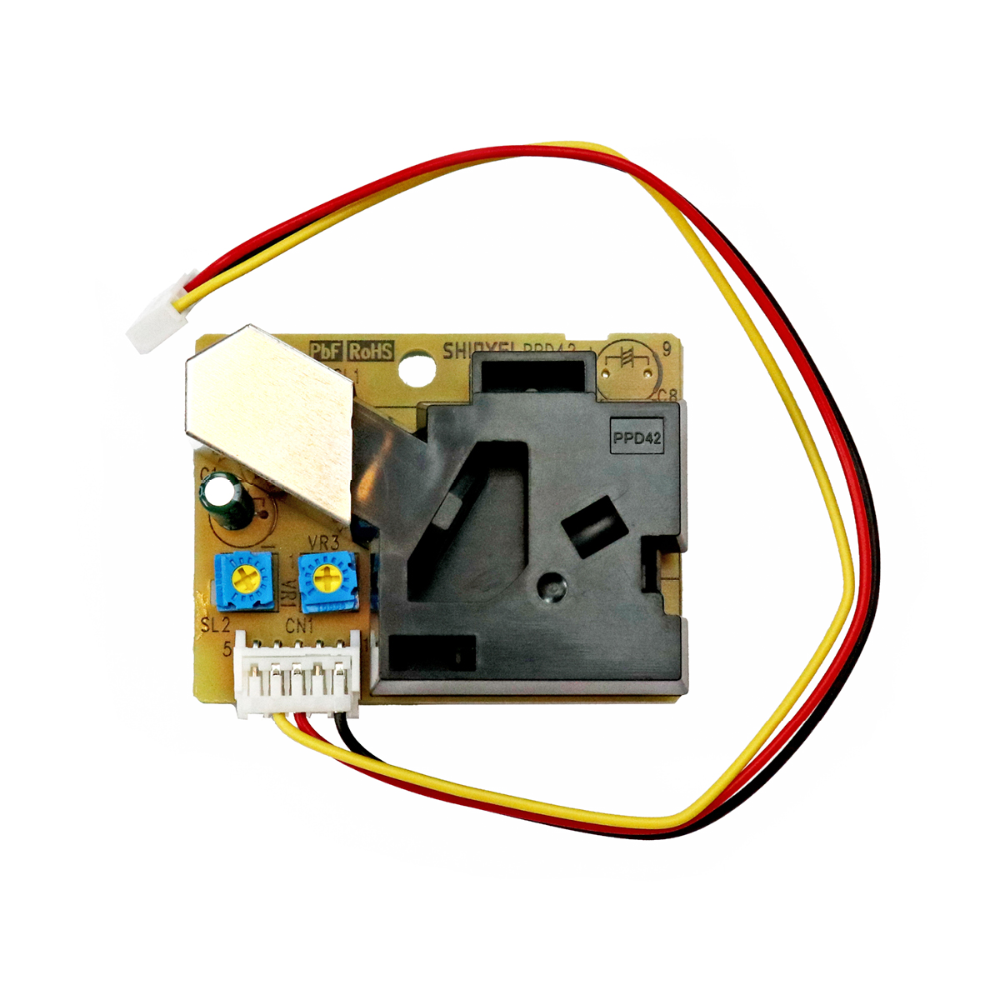

# Feinstaubsensor

## Beschreibung
Der Feinstaubsensor wertet die umgebende Luftqualität über die Feinstaubkonzentration aus. Die Feinstaubkonzentration wird dabei durch die Anzahl an erfassten Partikeln pro Zeiteinheit bestimmt. Der Sensor erfasst Feinstaubpartikel ab einer Größe von 1 µm und gibt einen Impuls bei jeder Erfassung eines Partikels aus. Er kann direkt oder mithilfe des Grove Shields an einen digitalen Pin eines Arduinos angeschlossen werden. Die Anzahl der Impulse kann schließlich mithilfe des Arduinos in die Feinstaubkonzentration umgerechnet werden.

Alle weiteren Hintergrundinformationen sowie ein Beispielaufbau und notwendigen Programmbibliotheken sind auf dem offiziellen Wiki (bisher nur in englischer Sprache) von Seeed Studio zusammengefasst. Zusätzlich findet man über alle gängigen Suchmaschinen durch die Eingabe der genauen Komponentenbezeichnung entsprechende Projektbeispiele und Tutorials.

<!-- infolist -->

<!-- infolists -->
## Wichtige Links für die ersten Schritte:

- [Seeed Studio Wiki](http://wiki.seeedstudio.com/Grove-Dust_Sensor/) [- Feinstaubsensor](http://wiki.seeedstudio.com/Grove-Dust_Sensor/)

## Weiterführende Hintergrundinformationen:

- [GPIO - Wikipedia Artikel](https://de.wikipedia.org/wiki/Allzweckeingabe/-ausgabe)
- [GitHub-Repository: Feinstaubsensor](https://github.com/MakeYourSchool/8-Feinstaubsensor)

